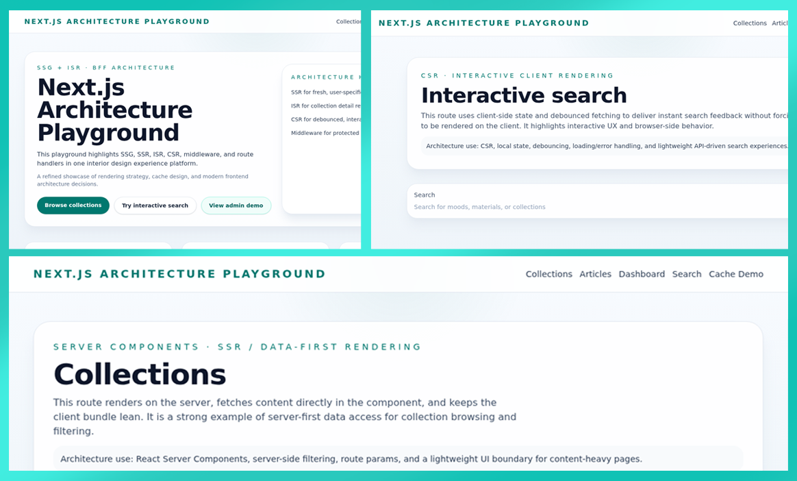

# Next.js 15 Architecture Playground

This project is a polished architecture showcase for an interior design experience platform. It is intentionally designed to demonstrate how a senior Next.js frontend engineer evaluates rendering strategy, caching, auth, authorization, route design, and platform architecture in a production-minded codebase.

The current implementation also includes a refined visual direction: a bright editorial palette with blue and green accents, stronger typography hierarchy, soft glass-card surfaces, and consistent presentation across the landing, collections, articles, dashboard, profile, search, and cache-demo views.

## What this project shows

This personal showcase demonstrates how a Next.js app can be structured to explore:

- rendering choices across SSG, SSR, ISR, and CSR
- cache and revalidation decisions in a real app flow
- middleware, auth, and protected-route behavior
- route handlers and a BFF-style data layer
- TypeScript-first architecture that stays readable as the project grows
- polished loading, error, and not-found states for a more complete product experience
- explicit cache-strategy reasoning for real-world rendering decisions
- test coverage for middleware and route-handler behavior

## Project screenshots



## What this project demonstrates

This app intentionally showcases the following concepts:

- React Server Components
- Client Components
- SSR
- SSG
- ISR
- CSR
- Middleware
- Authentication
- Authorization
- Route Handlers
- BFF Pattern
- Cache Strategies
- Revalidation
- CMS Integration
- Server vs Client Rendering Decisions
- TypeScript
- Modern Frontend Architecture

---

## Project purpose

The project is not a commerce app. It is an architecture-first playground focused on the trade-offs that shape real production systems: performance, UX, security, maintainability, and rendering discipline.

It now also includes:
- a more polished loading, error, and not-found experience
- a cache-demo section that explains why each strategy is chosen in practice
- tests that validate middleware and API-route behavior

The experience is centered around a flexible content-driven concept with curated visuals, editorial storytelling, and interactive sections that help demonstrate different rendering and UX patterns.

This framing makes it easy to explain why some pages are static, some are dynamic, and some are highly interactive — a common discussion point in senior frontend interviews.

---

## Architecture overview

### 1. App Router and route structure
The project uses the Next.js App Router to organize pages and API routes clearly.

Key areas:
- `/` — landing page with SSG + ISR
- `/collections` — server-rendered collection browsing
- `/collections/[slug]` — ISR detail pages
- `/articles` and `/articles/[slug]` — static article content
- `/dashboard` and `/profile` — SSR authenticated views
- `/admin` — SSR authorization-protected area
- `/search` — client-side interactive search with debouncing and error states
- `/cache-demo` — explicit cache strategy examples for static, dynamic, and ISR patterns
- `/api/*` — route handlers acting as a BFF layer

---

## Rendering strategies and why they were chosen

### React Server Components
React Server Components are used for server-first rendering where data is fetched directly on the server and the client receives only the rendered result.

Why this matters:
- lower client bundle size
- better performance for content-heavy pages
- secure access to server-side data

Example: `/collections` uses server rendering for collection listing and filtering.

### Client Components
Client Components are used where the user needs interactivity, state, or browser-only behavior.

Examples:
- `/search` uses local UI state and interactive user input
- client-side data fetching can be added without forcing the whole page to be rendered on the client

### SSR (Server-Side Rendering)
SSR renders the page on each request, which is ideal for user-specific or session-aware content.

Why SSR was chosen for `/dashboard` and `/profile`:
- data can depend on the current session
- the content must be fresh every time
- it avoids stale user-specific state

### SSG (Static Site Generation)
SSG generates HTML at build time and is best for content that is mostly stable and SEO-sensitive.

Why SSG was chosen for `/` and `/articles`:
- marketing and editorial pages benefit from fast delivery
- SEO metadata and static HTML are ideal here
- the content can be cached efficiently

### ISR (Incremental Static Regeneration)
ISR keeps static pages fresh by regenerating them in the background after a defined interval.

Why ISR was chosen for `/collections/[slug]`:
- collection pages are content-rich
- editors may update content over time
- the app still benefits from static performance while refreshing automatically

### CSR (Client-Side Rendering)
CSR is used when the interface must respond immediately to user interaction without a full server navigation.

Why CSR was chosen for `/search`:
- users expect instant filtering and results updates
- the page is interactive and state-driven
- it is a good fit for a lightweight search experience

---

## Middleware and route protection

Middleware is used to protect specific routes before the request reaches the page.

Protected paths:
- `/dashboard`
- `/profile`
- `/admin`

What it does:
- redirects unauthenticated users to the home page or login flow
- blocks unauthorized users from admin routes
- demonstrates how Next.js middleware can centralize access control

This is one of the clearest examples of how architecture can enforce policy at the edge of the request lifecycle.

---

## Authentication and authorization

The current demo uses a lightweight cookie-based role simulation to model authentication and authorization behavior.

Why this is useful:
- it shows the architecture pattern clearly without requiring a real provider setup
- it demonstrates how protected pages can depend on session or role information
- it mirrors how a real Auth.js integration would work in production

In production, this same structure would map naturally to Auth.js or another session provider.

---

## Route Handlers and BFF pattern

The application uses Route Handlers under `/api` to act as a backend-for-frontend (BFF) layer.

### Why Route Handlers exist
Route Handlers allow the frontend to call one consistent interface while the server composes the actual data.

This is useful because:
- it keeps data orchestration off the client
- it hides CMS or backend complexity from the UI
- it centralizes caching, validation, and shaping of response data
- it allows the app to present production-style UX patterns such as loading and error handling through route-driven architecture

### Why the BFF pattern matters
The BFF route `/api/homepage` can internally gather content from multiple sources and return a single response for the UI.

This is important for architecture interviews because it demonstrates:
- separation of concerns
- better frontend ergonomics
- controlled server-side orchestration

---

## Cache strategies

This project includes examples of different cache behaviors:

### Static cache
Used for content that should stay stable and be served efficiently.

### Dynamic data
Used for session-sensitive views or highly personalized content.

### ISR cache
Used for pages like collection details that should refresh periodically without full rebuilds.

These examples demonstrate how cache strategy is a product decision, not just a framework detail. The dedicated `/cache-demo` page makes the tradeoffs visible and easy to discuss in interviews or reviews.

---

## Revalidation

Revalidation is implemented through the `/api/revalidate` route.

This demonstrates how a CMS or editor can invalidate cached content and trigger a refresh of the UI.

Why this matters:
- editors want content updates to appear quickly
- the app can keep static performance while still allowing freshness
- cache invalidation becomes an explicit architectural capability

---

## CMS integration

The project is structured to model a CMS-driven architecture.

This is useful because a real production app often uses:
- CMS content for marketing pages
- structured content for collections and articles
- content updates that need revalidation and cache awareness

The project highlights how the UI should be decoupled from where content comes from.

---

## Server vs client rendering decisions

A major part of this project is showing when to choose each strategy.

### Choose Server Components when:
- data access is sensitive
- pages are mostly content-driven
- you want a smaller client bundle

### Choose Client Components when:
- the UI must respond to input immediately
- stateful interactions matter
- browser APIs are involved

### Choose SSR when:
- the response depends on the current user or session

### Choose SSG when:
- the page is mostly static and SEO-sensitive

### Choose ISR when:
- content should be mostly static but periodically refreshed

### Choose CSR when:
- the experience is highly interactive and user-driven

---

## TypeScript and modern architecture

The project is written in TypeScript to make the codebase explicit, scalable, and easier to reason about as the architecture grows.

Benefits shown here:
- safer data contracts
- clearer route and content models
- easier future extension for CMS or auth integrations

This fits the modern frontend architecture mindset of strong typing, separation of concerns, and predictable component boundaries.

---

## How to review this project

A reviewer should be able to immediately recognize:
- App Router usage
- Server vs client rendering boundaries
- protected routes and middleware logic
- cache strategy decisions
- BFF and route-handler structure
- CMS-oriented content architecture

---

## Run locally

```bash
npm install
npm run dev
```

Then open http://localhost:3000 to explore the project.

